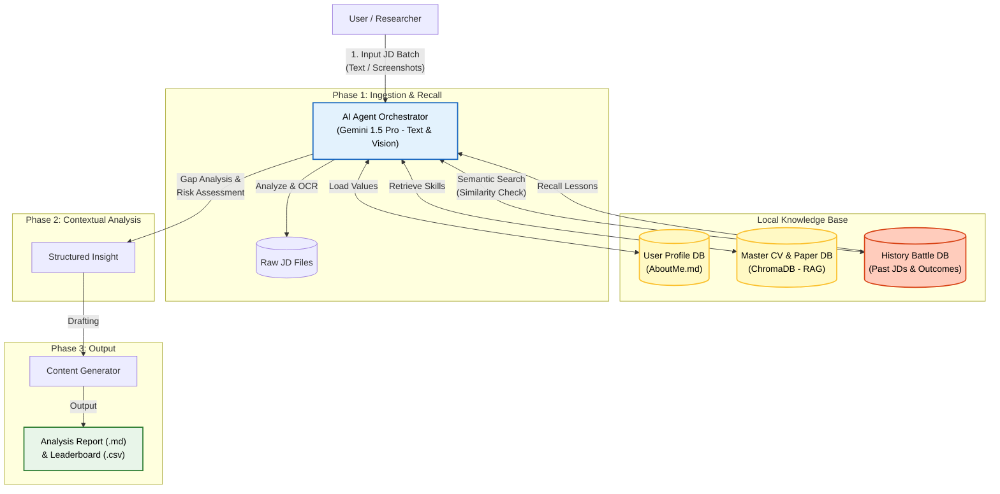

# Local LLM Decision Orchestrator: Job Hunting Season

> **Status:** MVP Validated (Local Execution / V1.1) <br>
> **Role:** Research Pilot for [Physically-Aware Synthetic Surveillance Data]

## 🎯 Motivation
The primary motivation behind this project is to address the inefficiency of manually filtering noise from job descriptions in the job market.

In job hunting, one must sift through hundreds of job descriptions to find the few that match complex constraints (e.g., visa rules, tech stack compatibility, remote work policies). Traditional keyword search fails to capture these semantic nuances. For example, a position that requires computer vision experience could drown in the title "Machine Learning Engineer".

This project was built to validate that a **Local LLM Agent** can serve as an intelligent filter and planner, solving this "needle in a haystack" problem while preserving data privacy.

Crucially, this project also serves as the pilot for a research project: **Real-World Data-Driven Synthetic Surveillance Dataset Generation Pipeline**.<br>
By treating video generation models and task-specific LoRAs as "Agents," the future research aims to leverage this same agentic workflow to significantly improve efficiency and reduce computational costs in synthetic data generation.

## 📖 Introduction

This project implements a **Hybrid AI Agent** powered by Google Gemini API, designed to leverage extensive user context to identify job descriptions that best fit my expertise.

Unlike purely local solutions, this system utilizes the state-of-the-art reasoning capabilities and long-context window of Gemini models to analyze my full background: including technical skills, financial goals, and visa constraints. It acts as an intelligent orchestrator that filters noise and provides strategic application advice, while keeping the core document storage (CVs/Databases) managed locally.

## 🏗️ System Architecture



## 🚀 Key Features
1.  **SOTA Semantic Filtering:**
    * Leverages **Google Gemini's** advanced reasoning to understand subtle nuances in JDs (e.g., distinguishing between "required" vs. "nice-to-have" skills), surpassing local models.
2.  **Multimodal Ingestion with Smart Caching:**
    * **Vision Capabilities:** Capable of processing **non-text inputs** (e.g., screenshots of job posts, scanned PDFs) using Gemini's vision model.
    * **Cost-Optimized:** Implements a **"Read-Once" policy**. Extracted text is automatically serialized and saved locally (`.txt`) to reduce API latency.
3.  **Context-Aware Planning (RAG):**
    * Dynamically retrieves the most relevant project experiences from a local personal database based on the specific requirements of the target position.
4.  **"War Room" Architecture (V1.1 - Closed-Loop History):**
    * **Battle Archive:** Automatically indexes the lifecycle of every application (JD + Resume Version + Outcome) into a local vector store.
    * **Active Recall:** When analyzing a new JD, the agent performs a semantic search against this "Battle Archive."
    * **Tactical Warning:** If a similar past application is found, the agent proactively retrieves the specific outcome (e.g., "Rejected due to Visa") to warn the user or suggest successful strategies from the past.

## ⚡ Quick Start & Setup

1. Environment Configuration (`.env`)
Create a `.env` file in the root directory. This is crucial for linking your local files (e.g., Google Drive) to the Docker container. (refer to .env_example)

2. Directory Setup
Refer to [Data Structure](#-data-structure)

3. Launch the System
Start the Docker container in detached mode: ```docker-compose up -d --build```

4. Memory Injection (Initialization)

    **Phase 1**: <br>Run these once initially, or whenever you update your Resume/AboutMe.md.
    * Ingest Personal Knowledge (Identity):<br> ```docker-compose run --rm orchestrator python src/ingest.py``` <br> Reads ```data/raw/AboutMe.md``` and whatever files in ```data/raw/``` to build the agent's core understanding of YOU.
    * Ingest Battle History (Experience):<br> ```docker-compose run --rm orchestrator python src/ingest_history.py``` <br> Scans your ```LOCAL_PATH_TO_...``` folders to index past applications for the "War Room" recall feature.

    **Phase 2**: The Hunt (Routine) <br>
    Execute this loop when adding new JDs.
    * Feed: Drop new JD PDFs (or images) into ```data/jds/```.
    * Hunt: Run the main orchestrator.<br> ```docker-compose run --rm orchestrator python src/main.py``` 
    * Review: Check the output in ```data/reports/```:
        * ```Strategic_Leaderboard.csv```: Prioritize applications.
        * ```Analysis_*.md```: Read detailed strategy & warnings.

    **Phase 3**: Post-Battle Maintenance<br> When you receive an outcome (Reject/Interview):
    * Move the JD folder from Ongoing to Rejected (on your local drive).
    * Add an ```result.txt``` or ```reject_letter.txt``` inside the folder.
    * Run Ingest History again to update the agent's memory:<br>```docker-compose run --rm orchestrator python src/ingest_history.py```

## 🛠️ Tech Stack
* **Orchestration:** Python, Google Generative AI SDK (Gemini API)
* **Model:** Gemma-3-12b
* **Vector Store:** ChromaDB (Using default `all-MiniLM-L6-v2` for local embeddings)
* **Environment:** Python 3.11 / Docker

## 📂 Data Structure
The system automatically manages raw inputs and cached outputs:

```text
data/
├── chroma_db/            # Vector Database (User Profile & History Index)
├── raw/                  # Personal Knowledge Base
│   ├── AboutMe.md        # Dynamic User Values (Money, Visa, Location)
│   └── cv_papers.pdf     # Resume & Academic Papers
├── jds/                  # Input: New JDs to Analyze
│   ├── position_A.pdf
│   └── position_A.txt    # Cached OCR/Text Result
├── reports/              # Output: Analysis Reports
│   ├── Analysis_A.md
│   └── Strategic_Leaderboard.csv      
└── history/              # Historical Battle Data
    ├── ongoing/          # Active Applications
    └── rejected/         # Past Failures (For Post-Mortem Recall)
```

## 🔮 Future Roadmap: Automated Optimization (V2.0)
Currently, the system serves as an intelligent advisor that *recalls* history. The V2.0 objective is to implement **Reinforcement Learning (RL)** logic to let the agent *learn* from history independently.

### Planned Capabilities
* **Global Trend Analysis (Beyond One-to-One):**
    * Instead of just recalling a specific past job, the agent will analyze aggregate data (e.g., "You have an 85% rejection rate when applying to 'FinTech' roles with 'CV Version B'. Stop doing that.")
* **Automated A/B Testing:**
    * Systematically generates two different "Persona Pitches" for similar roles, tracks the callback rate, and automatically updates the `Master CV` strategy weights based on the winner.
* **ATS Trap Detection:**
    * Reverse-engineers the "Black Box" of ATS systems by identifying common keyword patterns in `Auto-Reject` outcomes across different companies.
    
---
*This project is part of a broader research initiative on Agentic AI workflows for Data Synthesis.*