# Job Hunting Season 2: Agentic Career Orchestrator 
#### An ROI-Driven Multi-Agent System
> **Current Status:** V2.0 Design Phase (Architecture Validated / Implementation In Progress)
> **Role:** Research Pilot for [Physically-Aware Synthetic Surveillance Data]

## 🎯 Motivation

The primary motivation behind this project is to address the inefficiency of manually filtering noise from job descriptions in the job market.

In job hunting, one must sift through hundreds of job descriptions to find the few that match complex constraints (e.g., visa rules, tech stack compatibility, remote work policies). Traditional keyword search fails to capture these semantic nuances. For example, a position that requires computer vision experience could drown in the title "Machine Learning Engineer". 

Furthermore, effective job hunting requires more than just reading; it demands **verification** (checking market salary, validating research alignment), **reflection** (comparing against past applications to avoid repeated mistakes), and **strategic execution** (prioritizing high-ROI opportunities and allocating effort efficiently). These are processes that are computationally exhausting.


This project was built to validate that a Local LLM Agent can serve as an **autonomous decision orchestrator** to solve this "needle in a haystack" problem while preserving data privacy.

**Research Context:**  
This project also serves as the architectural pilot for **Real-World Data-Driven Synthetic Surveillance Dataset Generation Pipeline**. By treating video generation models and task-specific LoRAs as "Agents," the future research aims to leverage this same agentic workflow to significantly improve efficiency and reduce computational costs in synthetic data generation.

---

## 📖 Introduction

This project implements a **Hybrid AI Agent** powered by Google Gemini API, designed to leverage extensive user context to identify job descriptions that best align with the user's expertise and constraints.

Unlike purely local solutions, this system utilizes the **reasoning capabilities** and **long-context window** of Gemini models to analyze the full applicant background: including technical skills, financial goals, and visa constraints. It acts as an intelligent orchestrator that filters noise and provides strategic application advice. 

Moving beyond simple analysis, **V2.0** introduces:
- 🔧 **Tool Use** for external grounding (Salary checks / arXiv publication search)
- 🧠 **Reflective ROI Planning** for cross-JD comparison and resource allocation
- 👥 **Mixture of Experts (MoE)** for section-specific resume optimization guidance
- 🎯 **Autonomous Actions** for priority-based file organization

All core document storage (CVs, personal databases) remains **locally managed** via ChromaDB to maintain a structured local archive of user's career data, while the cloud API is used solely for reasoning tasks with sanitized inputs.

---
### System Evolution: V1.1 → V2.0

**V1.1 (Current Implementation):**
- ✅ Semantic filtering via RAG (Retrieval-Augmented Generation)
- ✅ Historical learning via "War Room" memory (past application outcomes)
- ✅ Multi-criteria analysis (skills, visa, location)
- ❌ Limited to internal knowledge (no external validation)
- ❌ Treats each JD independently (no cross-document comparison)

**V2.0 (Ongoing Architecture):**
- **Tool-Augmented Intelligence**: External verification via salary checks and publication searches
- **Global Reflection**: Cross-JD comparison with ROI-based prioritization
- **Expert Advisory System**: MoE-based strategic recommendations (NOT auto-generation)
- **Autonomous Action**: Automated file organization based on final scores

This upgrade transforms the system from a passive analyzer to an active decision orchestrator, capable of:
1. **Perceiving** job markets through external tools
2. **Reasoning** about relative priorities across multiple opportunities
3. **Planning** resource allocation based on ROI calculations
4. **Acting** on decisions through file system operations


## 🏗️ System Architecture

```mermaid
graph TD
    User["User Input<br/>(Batch JDs)"] --> Scouter["Phase 1: Intelligence Agent<br/>(The Scout)"]

    %% Phase 1: 盡職調查 (先查再說)
    subgraph "Phase 1: Intelligence Gathering"
        Scouter -->|"1. Parse JD"| JD_Content
        Scouter -->|"2. External Check"| Tools["Tools<br/>(Salary + arXiv)"]
        Scouter -->|"3. Internal Recall"| RAG["RAG Memory<br/>(Past Applications)"]
        
        JD_Content & Tools & RAG --> Context["General Context Report"]
    end

    %% Phase 2: 反思與 ROI (大腦核心)
    subgraph "Phase 2: Strategic Reflection"
        Context --> Reflector["Reflector Agent<br/>(The Strategist)"]
        Reflector -->|"Prioritize JDs"| Logic["ROI Calculation<br>Input: Rewrite_Effort, Match_Score, MisMatch_Score"]
        
        Logic --> Decision{ROI High?}
    end

    %% 分流：低分 -> 解釋原因 -> 歸檔
    Decision -- "No (Low ROI)" --> LogReject["Gen. Rejection Log<br/>(Why is ROI low?)"]
    LogReject --> FolderLow["Action: Move to<br/>/03_Ignore"]

    %% 分流：高分 -> MoE 改寫 -> 歸檔
    Decision -- "Yes (High ROI)" --> MoE_Router["Phase 3: MoE Router"]

    %% Phase 3: 執行改寫 (只針對值得的 JD)
    subgraph "Phase 3: Tactical Execution (MoE)"
        MoE_Router -->|"Research-Oriented"| Exp_Res["Advisor:<br>Research Fellow"]
        MoE_Router -->|"Engineer-Oriented"| Exp_Eng["Advisor:<br>Staff Engineer"]
        MoE_Router -->|"SoftSkill-Oriented"| Exp_Soft["Advisor:<br>Team Lead"]
        
        Exp_Res & Exp_Eng & Exp_Soft --> Assembler["Actionable Suggestions"]
    end

    Assembler --> FinalAction["Action: Move to<br/>/01_Must_Apply<br/>/02_Worth_Apply"]

    style LogReject fill:#ffcdd2,stroke:#c62828
    style FinalAction fill:#c8e6c9,stroke:#2e7d32
```



## 🚀 Key Features
### 1. Tool-Augmented Intelligence:
   * **External Grounding:** The system actively gathers external context before making decisions, moving beyond isolated JD analysis.
   * **Available Tools:**
      - Salary Validator: Estimate salary range according to position, company, location (mocking)
      - Publication Matcher: Searches arXiv/Google Scholar for company research output
      - Visa Compliance Checker: Keyword-based heuristic to detect sponsorship mentions
   * **Impact:** Filters out underpaid roles or fake "research" positions before wasting effort on applications.

### 2. Global Reflection & ROI-Based Planning:
   * **Cross-Document Reasoning:** Instead of treating each JD independently, the system performs comparative analysis across all opportunities.
   * **How It Works:**
      - Generate draft reports for all JDs
      - Query "War Room" memory for similar past applications
      - Calculate ROI: `Score = Match_Potential - Rewrite_Effort + History_Bonus`
      - Re-rank based on past success patterns, Master CV overlap, and opportunity cost
   * **Output:** Dynamic leaderboard with context-aware scores (not just keyword matching).

### 3. Mixture of Experts (MoE) for Strategic Guidance:
   * **Expert Advisory Panel:** Decomposes resume optimization into specialized sub-tasks.
      - 🔬 Research Advisor: Suggests publication emphasis, novelty keywords
      - ⚙️ Engineering Advisor: Proposes scale metrics, tech stack alignment
      - 👥 Leadership Advisor: Evaluates collaboration content, cultural fit
   * **Critical Note:** This system provides **targeted recommendations**, NOT auto-generated content. Users retain full control over final edits to ensure authenticity.
   * **Workflow:**
      - Router analyzes JD → determines which CV sections need attention
      - Only relevant experts consulted (saves tokens + time)
      - Structured suggestions with current text vs. recommended enhancements

### 4. Autonomous Action Execution:
   * **Priority-Based File Organization:**
      - High ROI (≥ 85) → `/01_Must_Apply/`
      - Medium ROI (70-84) → `/02_Worth_Apply/`
      - Low ROI (< 70) → `/03_Ignore/`
   * **Rejection Log Generation:** For ignored JDs, creates structured explanation of why ROI is low (past failures, salary misalignment, high effort)
   * **Action Plan Templates:** For must-apply roles, generates TODO lists with specific CV edits and outreach strategies

### 5. Context-Aware RAG with Historical Learning ("War Room"):
   * **Personal Knowledge Base:** ChromaDB stores structured resume, papers, and `AboutMe.md` (values/constraints)
   * **Battle Archive:** Automatically indexes lifecycle of every application (JD + Resume Version + Outcome)
   * **Active Recall:** When analyzing new JD, performs semantic search against past applications
   * **Tactical Warnings:** Proactively retrieves outcomes to inform strategy
      - Example: "Similar role 'Sony Machine Learning Engineer' rejected 3 months ago, possibly due to visa. Consider skipping or clarifying sponsorship first."

### 6. Privacy-First Hybrid Architecture:
   * **Local Storage:** All CVs, papers, personal notes stored in ChromaDB (never uploaded)
   * **Cloud Reasoning:** Gemini API used only for analysis tasks with sanitized inputs (PII redacted via `PrivacyShield`)
   * **Safeguards:** Automatic email/phone number redaction, no raw CV transmission, only analysis results returned

### 7. Multimodal Ingestion with Smart Caching:
   * **Vision Capabilities:** Processes non-text inputs (screenshots of job posts, scanned PDFs) using Gemini's vision model
   * **Cost-Optimized:** Implements "Read-Once" policy:extracted text saved locally as `.txt` to reduce API latency on re-analysis

## ⚡ Quick Start & Setup

1. Environment Configuration (`.env`)
Create a `.env` file in the root directory. This is crucial for linking your local files (e.g., Google Drive) to the Docker container. (refer to .env_example)

2. Directory Setup
Refer to [Data Structure](#-data-structure)

3. Launch the System
Start the Docker container in detached mode: ```docker-compose up -d --build```

4. Memory Injection (Initialization)

    **Phase 1**: <br>Run these once initially, or whenever you update your Resume/AboutMe.md.
    * Ingest Personal Knowledge (Identity):<br> ```docker-compose run --rm orchestrator python src/ingest.py``` <br> Reads ```data/raw/AboutMe.md``` and whatever files in ```data/raw/``` to build the agent's core understanding of YOU.
    * Ingest Battle History (Experience):<br> ```docker-compose run --rm orchestrator python src/ingest_history.py``` <br> Scans your ```LOCAL_PATH_TO_...``` folders to index past applications for the "War Room" recall feature.

    **Phase 2**: The Hunt (Routine) <br>
    Execute this loop when adding new JDs.
    * Feed: Drop new JD PDFs (or images) into ```data/jds/```.
    * Hunt: Run the main orchestrator.<br> ```docker-compose run --rm orchestrator python src/main.py``` 
    * Review: Check the output in ```data/reports/```:
        * ```Strategic_Leaderboard.csv```: Prioritize applications.
        * ```Analysis_*.md```: Read detailed strategy & warnings.

    **Phase 3**: Post-Battle Maintenance<br> When you receive an outcome (Reject/Interview):
    * Move the JD folder from Ongoing to Rejected (on your local drive).
    * Add an ```result.txt``` or ```reject_letter.txt``` inside the folder.
    * Run Ingest History again to update the agent's memory:<br>```docker-compose run --rm orchestrator python src/ingest_history.py```

## 🛠️ Tech Stack
* **Orchestration:** Python, Google Generative AI SDK (Gemini API)
* **Model:** Gemma-3-27b
* **Vector Store:** ChromaDB (Using default `all-MiniLM-L6-v2` for local embeddings)
* **Environment:** Python 3.11 / Docker

## 📂 Data Structure
The system automatically manages raw inputs and cached outputs:

```text
data/
├── chroma_db/            # Vector Database (User Profile & History Index)
├── raw/                  # Personal Knowledge Base
│   ├── AboutMe.md        # Dynamic User Values (Money, Visa, Location)
│   └── cv_papers.pdf     # Resume & Academic Papers
├── jds/                  # Input: New JDs to Analyze
│   ├── position_A.pdf
│   └── position_A.txt    # Cached OCR/Text Result
├── reports/              # Output: Analysis Reports
│   ├── Analysis_A.md
│   └── Strategic_Leaderboard.csv      
└── history/              # Historical Battle Data
    ├── ongoing/          # Active Applications
    └── rejected/         # Past Failures (For Post-Mortem Recall)
```

## 🔮 Future Roadmap: Automated Optimization (V3.0)
Currently, the system serves as an intelligent advisor that *recalls* history. The V3.0 objective is to implement **Reinforcement Learning (RL)** logic to let the agent *learn* from history independently.

### Planned Capabilities
* **Global Trend Analysis (Beyond One-to-One):**
    * Instead of just recalling a specific past job, the agent will analyze aggregate data (e.g., "You have an 85% rejection rate when applying to 'FinTech' roles with 'CV Version B'. Stop doing that.")
* **Automated A/B Testing:**
    * Systematically generates two different "Persona Pitches" for similar roles, tracks the callback rate, and automatically updates the `Master CV` strategy weights based on the winner.
* **ATS Trap Detection:**
    * Reverse-engineers the "Black Box" of ATS systems by identifying common keyword patterns in `Auto-Reject` outcomes across different companies.
    
---
*This project is part of a broader research initiative on Agentic AI workflows for Data Synthesis.*