# Job Hunting Season 2: Agentic Career Orchestrator 
#### An ROI-Driven Multi-Agent System
> **Current Status:** V2.1 Design Phase (Architecture Validated / Implementation In Progress)
> **Role:** Research Pilot for [Physically-Aware Synthetic Surveillance Data]

## 🎯 Motivation

The primary motivation behind this project is to solve the extremely low signal-to-noise ratio in the current job market and the unsustainable time cost of high-quality applications.

In job hunting, one must sift through hundreds of job descriptions to find the few that match complex constraints (e.g., visa rules, tech stack compatibility, remote work policies). Traditional keyword search fails to capture these semantic nuances. For example, a position that requires computer vision experience could drown in the title "Machine Learning Engineer". Manually parsing hundreds of JDs to find the few that align with specific constraints (e.g., Privacy-Preserving AI, European Visa sponsorship) is a exhausting process that is an inefficient process that drains cognitive resources.

Furthermore, effective job hunting requires more than just reading; it demands **verification** (checking market salary, validating research alignment), **reflection** (comparing against past applications to avoid repeated mistakes), and **strategic execution** (prioritizing high-ROI opportunities and allocating effort efficiently). 


This project is to build an ROI-Driven Agentic System that automates the "low-level filtering" and "strategic intelligence gathering." This ensures that the human candidate can allocate their limited bandwidth exclusively to high-leverage opportunities, shifting focus from searching to crafting the perfect application.


**Research Context:**  
This project also serves as the architectural pilot for **Real-World Data-Driven Synthetic Surveillance Dataset Generation Pipeline**. By treating video generation models and task-specific LoRAs as "Agents," the future research aims to leverage this same agentic workflow to significantly improve efficiency and reduce computational costs in synthetic data generation.

---

## 📖 Introduction

This project implements a Multi-Agent RAG Orchestrator powered by Google Gemini, designed to transform job hunting from a brute-force search into a strategic campaign.

Unlike monolithic approaches that rely on a single prompt to "analyze these JDs," this system decomposes the complex decision-making process into a pipeline of specialized agents. It leverages the reasoning capabilities of Gemini to process fragmented context: matching technical skills, research alignment, and hard constraints against individual job descriptions with high precision.

### 🚀 System Evolution: From V1 to V2.1
While V1 follows a predefined routine to analyze JDs, V2.1 introduces a decentralized Multi-Agent Architecture designed for strategic resource allocation.

The core evolution lies in moving from "1-to-1 Analysis" to "1-to-Many Strategy."

#### V1 (Legacy): A Rigid "Smart Filter"
   - **Fixed Linear Protocol**:<br> Processed data under a hard-coded procedure (Step A → B → C) regardless of the job context, lacking the autonomy to activate specific tools or skip unnecessary steps.
   - **Isolated & Internal**: <br>Relied solely on local text comparison; blind to external market realities (e.g., actual salary data, active research groups).
   - **Siloed Execution**: <br>Treated every JD as an independent event, lacking the ability to prioritize based on relative ROI.

#### V2.1 (Current): An Active "Strategic Commander
This upgrade transforms the system from a passive analyzer to an active decision orchestrator, executing a 4-step OODA loop:
   - **Reason (Dynamic Mixture of Experts (MoE))**:<br> Introduces a Router Agent that dynamically assembles an Expert Council based on the JD's nature. e.g. A " Senior Research Scientist" role triggers the Academic Analyst (evaluating research alignment), Manager (evaluating soft skills).
   - **Perceive (Tool-Augmented)**: <br> Breaks the "internal bubble" by autonomously verifying salaries and retrieving relevant arXiv papers to ground analysis in reality.
   - **Plan (MoE Advisory)**: <br>Replaces generic feedback with specific Battle Plans (e.g., "Fixing this gap unlocks 15 positions"), utilizing a Mixture of Experts approach.
   - **Act (Hard-Triage)**: <br>Actively rejects non-viable roles (Visa/PhD constraints) before wasting human attention.
   

All core document storage (CVs, personal databases) remains **locally managed** via ChromaDB to maintain a structured local archive of user's career data, while the cloud API is used solely for reasoning tasks with sanitized inputs.

---


## 🏗️ System Architecture

```mermaid
graph TD
    %% === 全域 Council 資源池 (MoE) ===
    subgraph Pool ["🏛️ The Expert Council Pool (MoE)"]
        direction LR
        E1["👔 HR Gatekeeper<br/>(Culture Fit, Soft Skills & Red Flags)"]:::council
        E2["⚙️ Tech Lead<br/>(Tech Stack Depth & Hard Skills)"]:::council
        E3["♟️ Strategist<br/>(ROI, Tax, Location Tier & Stability)"]:::council
        E4["🛂 Visa Officer<br/>(Work Permit & Legal Feasibility)"]:::council
        E5["🔬 Academic<br/>(Pubs, Research Impact & Innovation)"]:::council
        E6["🏗️ Architect<br/>(Scalability, Cloud & Prod-Readiness)"]:::council
        E7["🦁 Leadership<br/>(Mentorship & Cross-functional Influence)"]:::council
        E8["🚀 Startup Vet<br/>(Equity, Risk & Multi-tasking)"]:::council
    end
    
    %% === LEVEL 0: 履歷軍火庫 ===
    subgraph L0 ["Level 0: Pre-processing"]
        ResumeDB[("🗄️ Resume Vector DB")]:::db
        PersonalDB[("🗄️ Personal Vector DB")]:::db
        IndexerCV["🤖 Indexer Agent"]:::agent
        IndexerPK["🤖 Indexer Agent"]:::agent
        
        ResPDFs --> IndexerCV --> ResumeDB
        AllFiles --> IndexerPK --> PersonalDB


    end

    %% === Phase 1: 戰場情報 ===
    subgraph P1 ["Phase 1: Intelligence Gathering"]
        Parser["JD Parser"]:::agent --> RawText[("📄 Raw Text")]
        RawText --> Tools["🌍 External Tools"]:::agent
        RawText & Tools --> Dossier["🗂️ Enriched Dossier"]:::doc
    end

    %% === Phase 2: 檢傷分類 ===
    subgraph P2 ["Phase 2: Intelligent Triage"]
        Dossier --> Triage["🏥 Triage Agent <br/> Hard Constraints Check(Visa)"]:::agent
        PersonalDB -.-> Triage["🏥 Triage Agent <br/> Hard Constraints Reject(Visa/PhD)"]
     
        Triage -- "❌ Reject" --> RejectLog["📝 Rejected_Log.json<br/>(Brief Reason)"]:::output
        RejectLog --> Bin["📂 /99_Trash"]

        Triage -- "✅ Pass" --> Metadata["Metadata<br/>(Role/Domain)"]:::doc
        Metadata --> Router
    end

    %% === Phase 3 流程 ===
    subgraph P3 ["Phase 3: Expert Diagnosis"]
        Metadata --> Router["🔀 Council Router"]:::agent
        Dossier --> Router

        Router --> |"Calls"| ActivePanel
        
        subgraph ActivePanel ["🧑‍⚖️ Active Panel(Same Instance, Different Modes)"]
            direction TB
            Panel1["🔍 Skill Analysis Mode"]:::panel
            Panel2["🧠 Gap & Effort Analysis Mode"]:::panel
            Panel1 --> |"Requirement Context"|Panel2
        end
        
        Dossier --> Panel2
        Panel1 --> |"Search Queries"| Retriever["🤖 Retriever"]:::agent

        Retriever <-.-> |"Evidence/Chunks"| PersonalDB
        Retriever <-.-> |"Reusable Sentences"| ResumeDB
        Retriever --> |"Retrieved Material"| Panel2

        Panel2 --> Out["📊 Strategy Data (Blueprint)"]:::output
    end

    %% === Phase 4: 戰略地圖 ===
    subgraph P4 ["Phase 4: Strategic Command"]
        Out & Metadata --> MapEngine["🗺️ Correlation Engine"]:::agent
        MapEngine --> VisualMap["Visual Correlation Map"]
        VisualMap --> TheGeneral["👮 Strategist"]:::agent
        TheGeneral --> BattlePlan["📊 ImpactReport"]:::output
    end

    %% === Human Loop ===
    BattlePlan --> UserCheck{"👤 User Review"}
    UserCheck -- "Approve" --> BriefingAgent["⚡ Briefing Agent"]:::agent

    UserCheck -- "Modify / Veto" --> Refine["Adjust Plan"]
    Refine --> BriefingAgent

    %% === Phase 5: 戰術執行 ===
    subgraph P5 ["Phase 5: Campaign Output"]
        BriefingAgent -->|"Cluster Context"| Panel3["👨‍🔬 Advisor Mode"]:::panel
        PersonalDB -.->|"Personal Knowledge"| Panel3["👨‍🔬 Advisor Mode"]:::panel
        ResumeDB -.->|"Past Resume"| Panel3["👨‍🔬 Advisor Mode"]:::panel

        Panel3 --> OutputA["📂 /01_Campaign_Privacy<br/>- 📄 Strategy_Guide.md (Advice: Insert X objective in project A)<br/>- 📂 10 Target JDs"]:::output
        Panel3 --> OutputB["📂 /02_Campaign_Infra<br/>..."]:::output
    end

    %% === 樣式定義 (跨模式相容) ===
    classDef council fill:#e1bee7,stroke:#4a148c,color:#000;
    classDef panel fill:#fff9c4,stroke:#fbc02d,color:#000;
    classDef agent fill:#c8e6c9,stroke:#2e7d32,color:#000;
    classDef db fill:#bbdefb,stroke:#1565c0,color:#000;
    classDef doc fill:#f5f5f5,stroke:#616161,color:#000;
    classDef output fill:#ffccbc,stroke:#d84315,color:#000;
``` 




## 🚀 Key Features
#### 1. The Arsenal: Semantic Resume Indexing (Level 0)
   * **Pre-processing Agent:** An asynchronous `Indexer Agent` breaks down the user's Master CV and Papers into semantic fragments tagged by attributes (e.g., `#Privacy`, `#ComputerVision`, `#Leadership`).
   * **Vector-Based Retrieval:** Uses **ChromaDB** to retrieve only the relevant "skills blocks" needed for a specific JD, preventing context window pollution with irrelevant experiences.

#### 2. Tool-Augmented Intelligence (Phase 1)
   * **External Grounding:** The system actively gathers external context to "comprehend" the JD before analysis.
   * **Active Tools:**
      - **Salary Validator:** Queries external sources (mock Levels.fyi/Glassdoor) to verify if the ROI justifies the effort.
      - **Team Investigation:** Searches arXiv/Google Scholar to verify if the hiring team is scientifically active.

#### 3. Intelligent Triage & Gatekeeping (Phase 2)
   * **Hard Constraints Check:** A strict "Gatekeeper Agent" enforces physical survival constraints first.
   * **Filtering Logic:** Automatically rejects roles based on **Visa Sponsorship** feasibility (EU Work Permit), **PhD Relevance**, and **Expertise mis-Matched** constraints.
   * **Impact:** Reduces compute costs and cognitive load by ensuring only "playable" opportunities enter the analysis pipeline.

#### 4. Dynamic Mixture of Experts (Phase 3)
   * **Router-Based Diagnosis:** Instead of a generic "Analysis Prompt," a Router activates specific agents based on the JD's domain.
   * **Expert Council:**
      - *Academic Analyst:* For Research Scientist roles (Focus: Paper alignment).
      - *Engineering Lead:* For MLE roles (Focus: Deployment/C++).
      - *Startup Scout:* For early-stage companies (Focus: Equity/Risk).
   * **Benefit:** Provides domain-specific gap analysis rather than generic career advice.

#### 5. Strategic Clustering (Phase 4 - The War Room)
   * **Correlation Engine:** Cross validate JDs to compute the correlations between to help prioritise applications.
   * **Battle Plans:** Instead of 15 separate resume edits, the system generates a unified strategy (e.g., *"Injecting [Self-Supervised Learning] insights into Project A will have positive impact on these 12 JDs"*).

#### 6. Advisory Briefing Agent (Phase 5)
   * **Strategy over Generation:** The system acts as a **Chief of Staff**, delivering a `Strategy_Guide.md` ("The What and Why") rather than just ghostwriting the resume ("The How").
   * **Actionable Insights:** Provides specific directives like *"Highlight Paper X to counter the lack of Spark experience,"* preserving the user's authentic voice.


## ⚡ Quick Start & Setup

1. Environment Configuration (`.env`)
Create a `.env` file in the root directory. This is crucial for linking your local files (e.g., Google Drive) to the Docker container. (refer to .env_example)

2. Directory Setup
Refer to [Data Structure](#-data-structure)

3. Launch the System
Start the Docker container in detached mode: ```docker-compose up -d --build```

4. Memory Injection (Initialization)

    **Step 1**: <br>Run these once initially, or whenever you update your Resume/AboutMe.md.
    * Ingest Personal Knowledge (Identity):<br> ```docker-compose run --rm orchestrator python src/data/ingest.py``` <br> Reads ```data/raw/AboutMe.md``` and whatever files in ```data/raw/``` to build the agent's core understanding of YOU.
    * Ingest Battle History (Experience):<br> ```docker-compose run --rm orchestrator python src/ingest_history.py``` <br> Scans your ```LOCAL_PATH_TO_...``` folders to index past applications for the "War Room" recall feature.

    **Step 2**: The Hunt (Routine) <br>
    Execute this loop when adding new JDs.
    * Feed: Drop new JD PDFs (or images) into ```data/jds/```.
    * Hunt: Run the main orchestrator.<br> ```docker-compose run --rm orchestrator python src/main.py``` 
    * Review: Check the output in ```data/reports/```:
        * ```Strategic_Leaderboard.csv```: Prioritize applications.
        * ```Analysis_*.md```: Read detailed strategy & warnings.

    **Step 3**: Post-Battle Maintenance<br> When you receive an outcome (Reject/Interview):
    * Move the JD folder from Ongoing to Rejected (on your local drive).
    * Add an ```result.txt``` or ```reject_letter.txt``` inside the folder.
    * Run Ingest History again to update the agent's memory:<br>```docker-compose run --rm orchestrator python src/ingest_history.py```

## 🛠️ Tech Stack
* **Orchestration:** Python, Google Generative AI SDK (Gemini API)
* **Model:** Gemma-3-27b
* **Vector Store:** ChromaDB (Using default `all-MiniLM-L6-v2` for local embeddings)
* **Environment:** Python 3.11 / Docker

## 📂 Data Structure
The system automatically manages raw inputs and cached outputs:

```text
data/
├── chroma_db/            # Vector Database (User Profile & History Index)
├── raw/                  # Personal Knowledge Base
│   ├── AboutMe.md        # Dynamic User Values (Money, Visa, Location)
│   └── cv_papers.pdf     # Resume & Academic Papers
├── jds/                  # Input: New JDs to Analyze
│   ├── position_A.pdf
│   └── position_A.txt    # Cached OCR/Text Result
├── reports/              # Output: Analysis Reports
│   ├── Analysis_A.md
│   └── Strategic_Leaderboard.csv      
└── history/              # Historical Battle Data
    ├── ongoing/          # Active Applications
    └── rejected/         # Past Failures (For Post-Mortem Recall)
```

## 🔮 Future Roadmap: Automated Optimization (V3.0)
Currently, the system serves as an intelligent advisor that *recalls* history. The V3.0 objective is to implement **Reinforcement Learning (RL)** logic to let the agent *learn* from history independently.

### Planned Capabilities
* **Global Trend Analysis (Beyond One-to-One):**
    * Instead of just recalling a specific past job, the agent will analyze aggregate data (e.g., "You have an 85% rejection rate when applying to 'FinTech' roles with 'CV Version B'. Stop doing that.")
* **Automated A/B Testing:**
    * Systematically generates two different "Persona Pitches" for similar roles, tracks the callback rate, and automatically updates the `Master CV` strategy weights based on the winner.
* **ATS Trap Detection:**
    * Reverse-engineers the "Black Box" of ATS systems by identifying common keyword patterns in `Auto-Reject` outcomes across different companies.
    
---
*This project is part of a broader research initiative on Agentic AI workflows for Data Synthesis.*